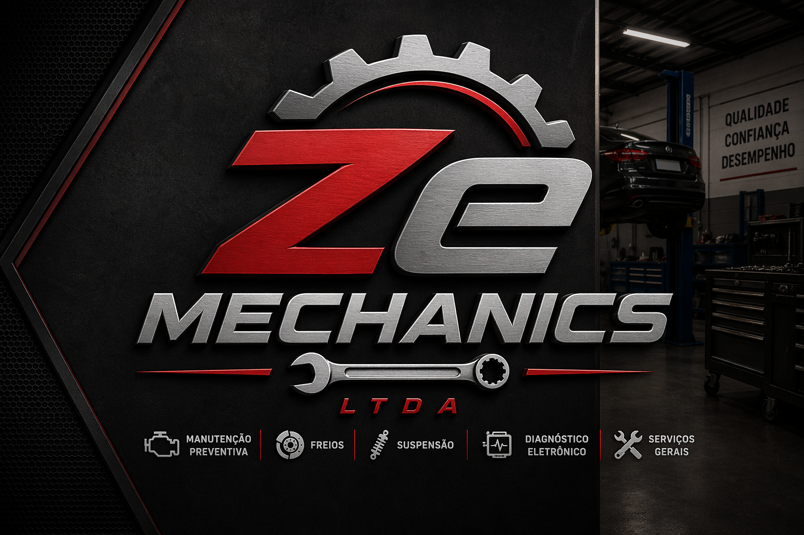

<div align="center">
    
</div>

<br>
<br>
<br>

# ZeMechanics

Seja muito bem-vindo à ZeMechanics!

A melhor mecânica da região de Osasco, a única com especialidade em desmanche de carro, seja blindado ou não!

>Também reparamos os carros feitos *só para rodar*!! 

## Resumo

Todo o código foi desenvolvido utilizado **Python**, mais especificamente **FastAPI** por questões de conhecimento na linguagem e facilidade no aprendizado de desenvolvimento de APIs utilizando o *FastAPI*.

O Banco da aplicação é **MySQL**, o motivo: É eficiente, e para um sistema onde é necessário trabalhar com um conjunto de dados relacionais como **cliente = veículo**, um banco de dados relacional se encaixa perfeitamente, além disso, o conhecimento prévio em MySQL foi também levado em conta ao escolher o mesmo. 

A escolha da biblioteca **FastAPI** foi devido a sua curva de aprendizado ser menor, não significando que ela é ruim, e sim possuí uma série de facilidades na hora do desenvolvimento, uma deles é criar automaticamente um **Swagger UI** para a aplicação.

Para **análise de código** foi utilizado o SonarQube, uma das maiores ferramentas de análise de código.


## Índice

* ➡️ [Estrutura de diretórios](docs/estrutura_diretorios.md)
* ➡️ [Configurações do app/core](docs/core-configuracoes.md)
* ➡️ [Como criar um ambiente virtual - Windows](docs/como-criar-venv.md)
* ➡️ [Quais são as rotas existens](docs/apis-rotas.md)

## Stack

<p align="center">
          
</p>

## Como implementar

### 01 - Requisitos mínimos:
* Docker & Docker Compose
* Python 3.x
* Git CLI

> É extremamente recomendado o uso de ambiente virtual (venv): [Como criar um Venv (windows)](docs/como-criar-venv.md)

### 02 - Clone o repositório
```bash
git clone https://github.com/cl0uD-C1SC0/ZeMechanics.git
```

### 03 - Acesse o repositório & Branch correta
```bash
cd ZeMechanics
git checkout feat/init_project
```

### 04 - Inicie a stack compose:
```bash
docker-compose up -d
```

> A Stack do docker-compose está subindo junto um serviço localmente chamado **SonarQube**, caso não precise, necessário comentar os services: db_sonarqube & sonarqube.

### 05 - Aguarde todos os containers subirem

### 06 - Geração de Token JWT
* Acesse as rotas de: **AUTH**
* Acesse a rota: **login**
* Faça o login com as credenciais já geradas:
    * Usuário: admin
    * Senha: admin123

> As credenciais são simples e estão sendo colocadas aqui por motivo didáticos apenas, em um ambiente real isso seria gerado de forma dinâmica e não seria compartilhada de uma maneira simples assim.

### 07 - Teste o fluxo **completo**:
* Cadastre um usuário
* Cadastre um veículo ao usuário
* Cadastre um serviço
* Cadastre uma peça
* Crie uma OS
* Avance o status da OS até: **Aguardando Aprovação**
* Ao chegar em **Aguardando Aprovação** acesse: http://localhost:1080/#/
* Abra o e-mail e aprove a OS
* Avance novamente a OS até ser finalizada

## 📫 Vamos nos conectar?

<p align="center">
  <a href="https://www.linkedin.com/in/jgsiqueiraa/">
    
  </a>
  <a href="https://github.com/cl0uD-C1SC0">
    
  </a>
</p>

<br><br>


<h4 align="center">
   © 2026 Ze Mechanics LTDA. O lugar perfeito para carro de leilão, feito apenas para rodar. 🚀
</h4>